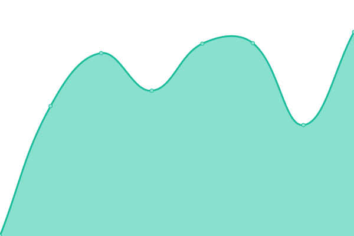
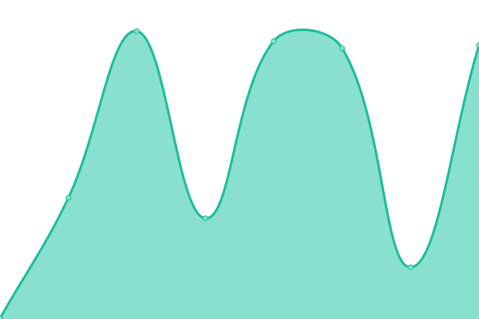
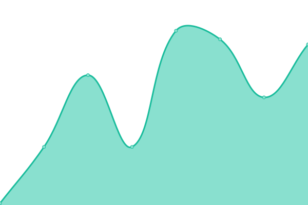

# [📈 Live Status](https://status.wordnik.com): <!--live status--> **🟩 All systems operational**

This repository contains the open-source uptime monitor and status page for [Wordnik](http://developer.wordnik.com), powered by [Upptime](https://github.com/upptime/upptime).

With [Upptime](https://upptime.js.org), you can get your own unlimited and free uptime monitor and status page, powered entirely by a GitHub repository. We use [Issues](https://github.com/Wordnik/wordnik-status/issues) as incident reports, [Actions](https://github.com/Wordnik/wordnik-status/actions) as uptime monitors, and [Pages](https://status.wordnik.com) for the status page.

<!--start: status pages-->
<!-- This summary is generated by Upptime (https://github.com/upptime/upptime) -->
<!-- Do not edit this manually, your changes will be overwritten -->
<!-- prettier-ignore -->
| URL | Status | History | Response Time | Uptime |
| --- | ------ | ------- | ------------- | ------ |
|  [Wordnik Community](https://www.wordnik.com/community) | 🟩 Up | [wordnik-community.yml](https://github.com/wordnik/wordnik-status/commits/HEAD/history/wordnik-community.yml) | 

 1215ms
     
 | 

<a href="https://status.wordnik.com/history/wordnik-community">98.18%</a>
    

|  [Wordnik Developer](https://developer.wordnik.com) | 🟩 Up | [wordnik-developer.yml](https://github.com/wordnik/wordnik-status/commits/HEAD/history/wordnik-developer.yml) | 

 1455ms
     
 | 

<a href="https://status.wordnik.com/history/wordnik-developer">98.72%</a>
    

|  Wordnik API (definitions) | 🟩 Up | [wordnik-api-definitions.yml](https://github.com/wordnik/wordnik-status/commits/HEAD/history/wordnik-api-definitions.yml) | 

 380ms
     
 | 

<a href="https://status.wordnik.com/history/wordnik-api-definitions">100.00%</a>
    

|  Wordnik API (random word) | 🟩 Up | [wordnik-api-random-word.yml](https://github.com/wordnik/wordnik-status/commits/HEAD/history/wordnik-api-random-word.yml) | 

 108ms
     
 | 

<a href="https://status.wordnik.com/history/wordnik-api-random-word">100.00%</a>
    

<!--end: status pages-->

[**Visit our status website →**](https://status.wordnik.com)

## 📄 License

- Powered by: [Upptime](https://github.com/upptime/upptime)
- Code: [MIT](./LICENSE) © [Wordnik](http://developer.wordnik.com)
- Data in the `./history` directory: [Open Database License](https://opendatacommons.org/licenses/odbl/1-0/)
